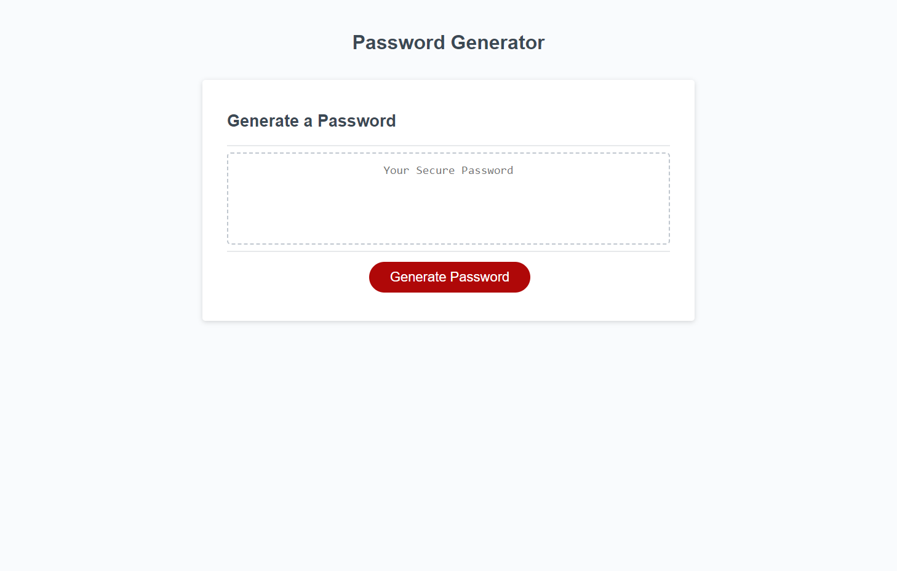

# PASSWORD GENERATOR

# Link

https://williamgeorgethomas.github.io/challenge-3/

# Purpose

This application was created to generate random passwords between 1 and 128 characters with the option to include lowercase letters, uppercase letters, numbers, and special characters.

# My Experience

Finishing this application from the starter code given was quite difficult. Being new to JavaScript, it has taken time to grasp it. This was a good project to understand some of the capabilities of the language.

# Screenshot

# Credits

Created by William George Thomas, 2022
